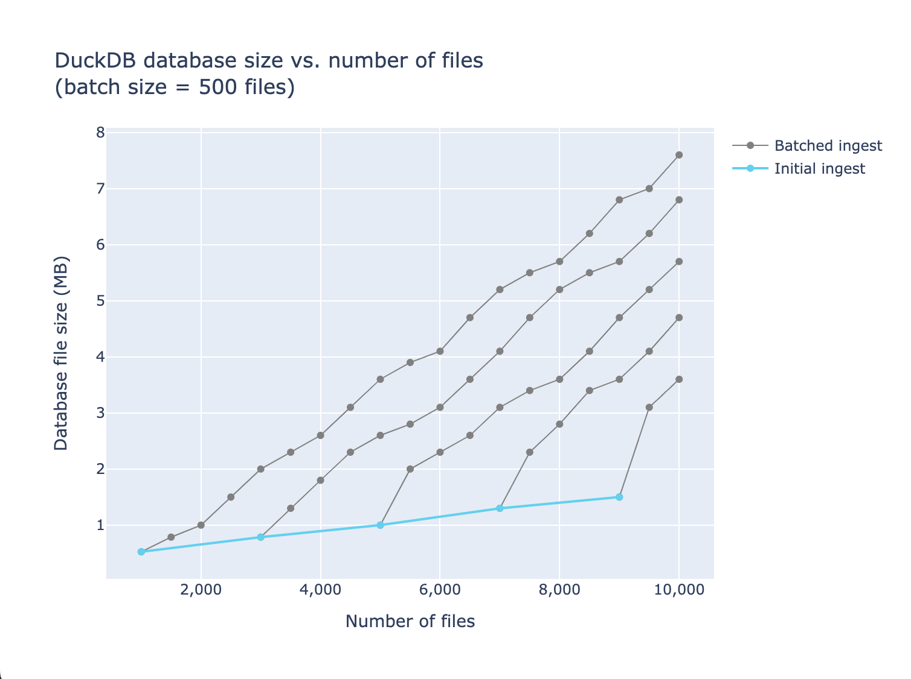

# duckdb-db-size
To test how duckdb database file format grows as files are appended/ingested in batches.

## Context

The sample dataset is a collection of JSON files built from querying and saving an endpoint's response once every 5 minutes. The sample has around 10k files / a month's worth of data. The data is saved to S3 storage but DuckDB is used to cache a `read_json('*.json')` result to avoid the time cost of globbing thousands of small files at once. After that initial ingest, new files are inserted as rows individually or in small batches.

## Database size issue

DuckDB is great at compressing a large number of files when importing them all at once. However, ingesting a partial number of those files and batch ingesting the rest causes the database file size to grow much faster than the initial insert would. More batches leads to larger database size even though the final number of files is the same.

## Experiment

This code uses the dataset sample to simulate datasets being inserted into DuckDB databases through different ingestions. Parameters include the initial ingestion sizes (`num_starting_files_options`) and batch size. Database size post-ingestion is read from DuckDB's pragma after restarting the connection.

## Accessing data

Results are saved in two DuckDB files in the `databases/` folder. Use CLI or preferred tool to access them.

## Running the code

If you want to change some parameters, the steps are somewhat:

1. Install dependencies from `requirements.txt` using your Python (ex. 3.10.7 was used here)
2. Run the four scripts in order as numbered in the filenames
3. View plots after running the last script
4. To change parameters, edit the top variables in the simulation script and rerun from there